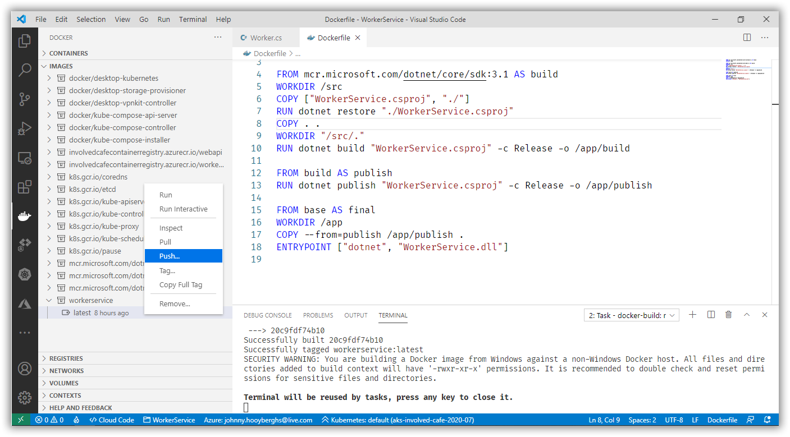
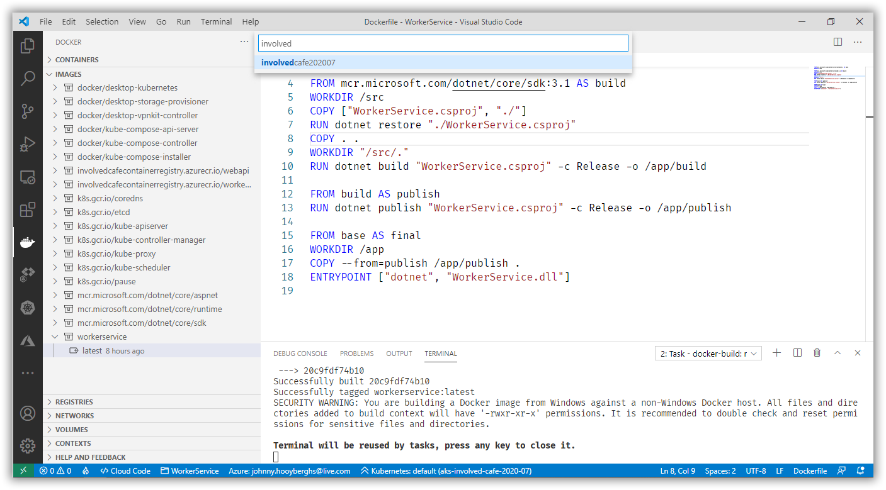
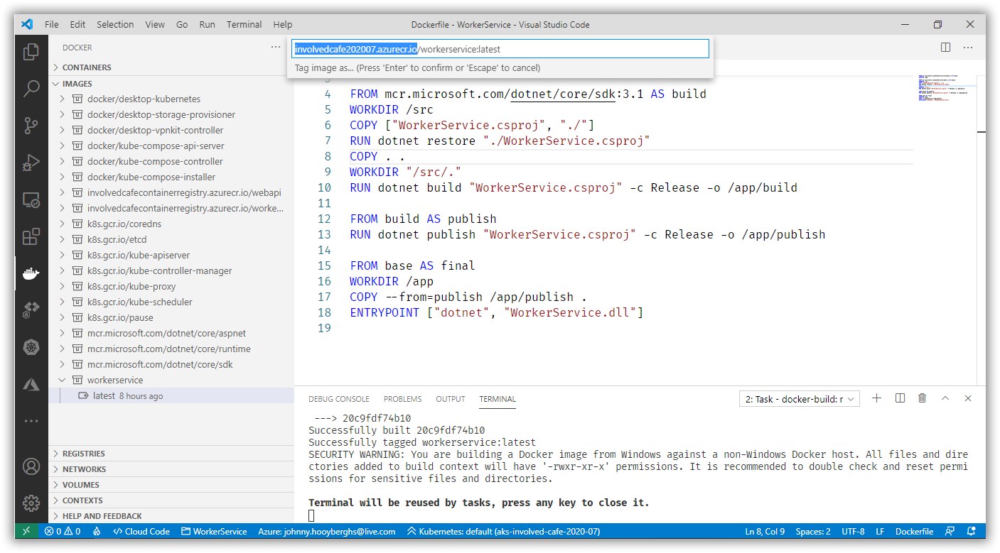
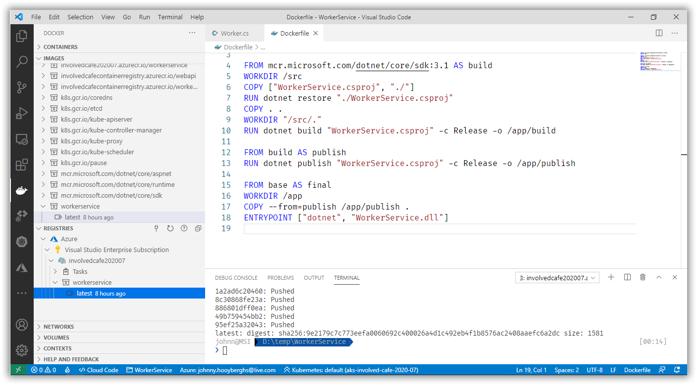
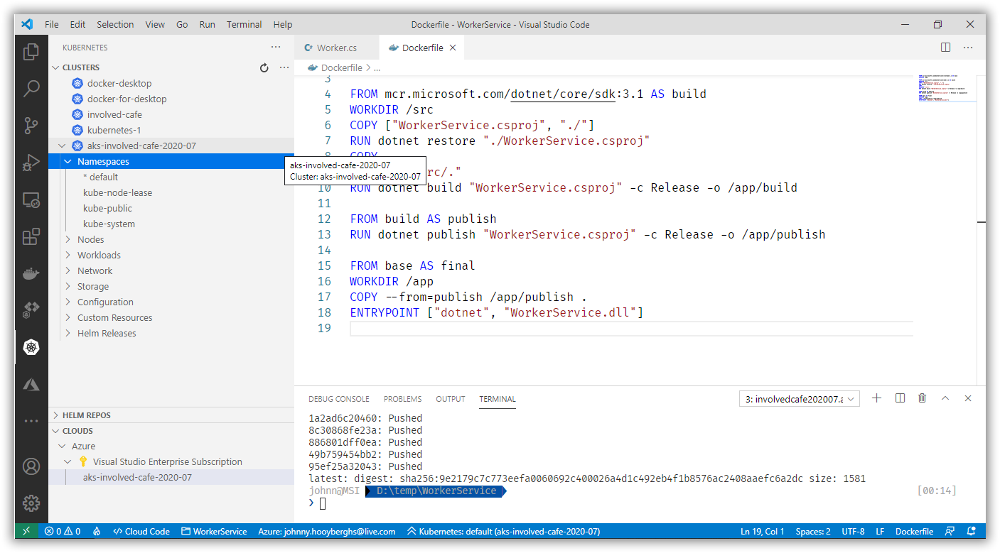
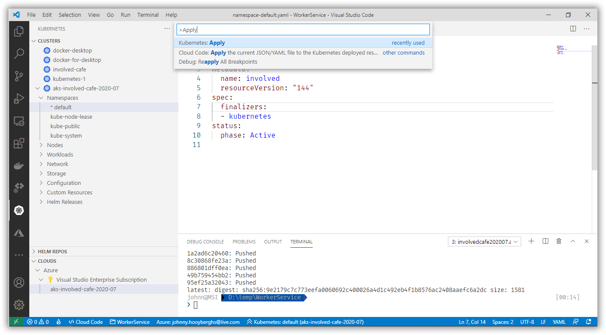
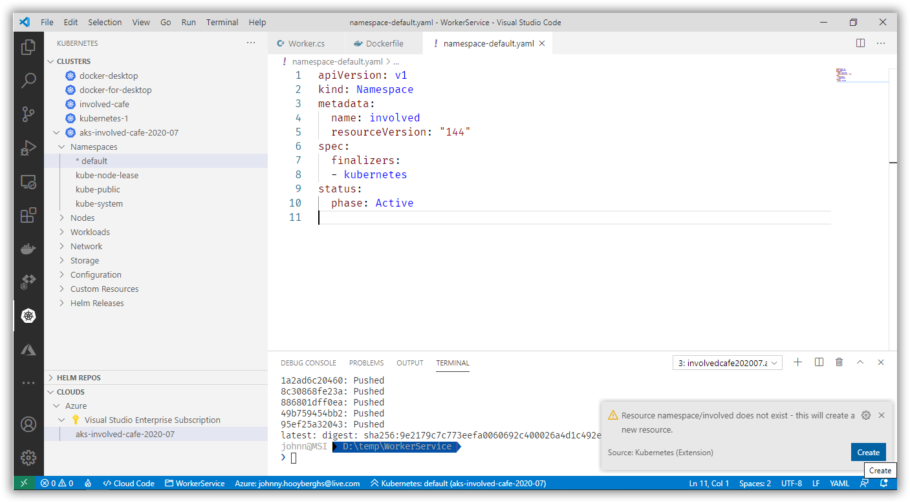
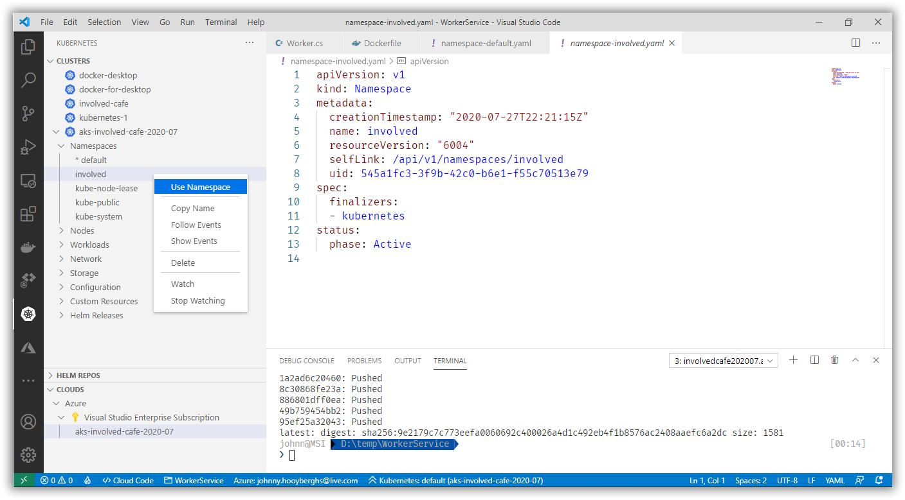
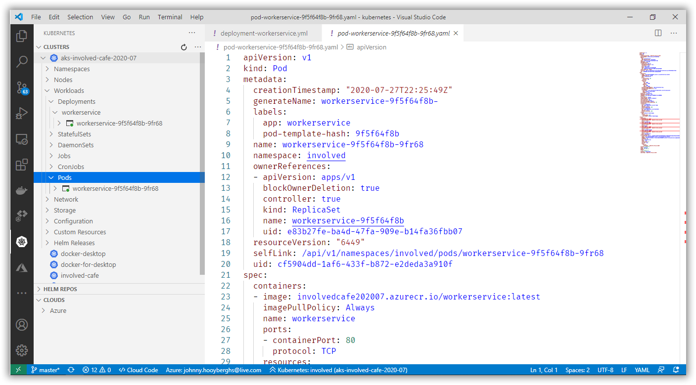
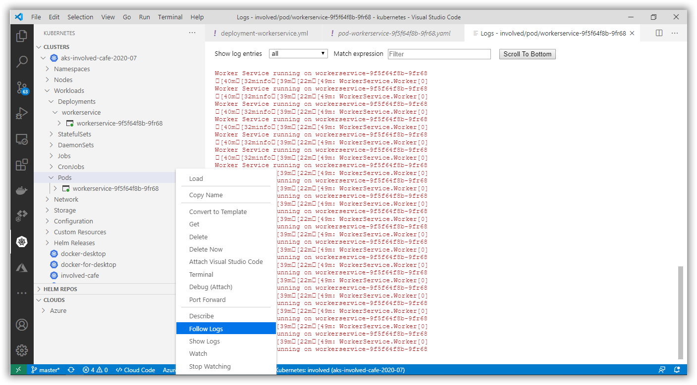

# BuildingCloudNativeApplicationsUsingOrleans-DevSum-2023

[Previous step](../step-05/README.md) - [Next step](../step-07/README.md)

## Step 6 - Deploy the Worker Service inside the Kubernetes cluster

Open your WorkerService project in Visual Studio Code and build the docker image so you are able to find it in your Visual Studio Code docker activity containers pane. Right click your latest tag and push the image to a container repository:



The Visual Studio Code command palette will ask you to specify the container registry and, if connecteed to Azure properly, you should be able to find your container registry:





If the push was successfull, you should be able to find a copy of your Docker image inside the Registries pane:



Select Kubernetes in the Visual Studio Code activity pane and open up your Kubernetes cluster's namespaces list:



You are going to create a new namespace. Double-click the default namespace and modify the YAML script:

```yaml
apiVersion: v1
kind: Namespace
metadata:
  name: dotnetdeveloperdays
spec:
  finalizers:
  - kubernetes
status:
  phase: Active
```

Open the Visual Studio Code command palette and find the Kubernetes: Apply command:



Confirm the creation of the namespace and use it as the selected namespace:





Create a new file called **deployment-workerservice.yaml** in Visual Studio Code and use the following content:

```yaml
apiVersion: apps/v1
kind: Deployment
metadata:
  name: workerservice
spec:
  replicas: 1
  selector:
    matchLabels:
      app: workerservice
  template:
    metadata:
      labels:
        app: workerservice
    spec:
      containers:
      - name: workerservice
        image: dotnetdeveloperdays2022.azurecr.io/workerservice:latest
        resources:
          limits:
            memory: "128Mi"
            cpu: "500m"
```

Use the Kubernetes: Apply command to use this deployment script and create and run the Kubernetes Pod.

Find the running Kubernetes Pod by looking in the Kubernetes activity pane and expanding your Clusters, Workloads, Deployments and Pods:



Right-click on the running Pod and choose Follows Logs to see the console output from the WorkerService:



[Previous step](../step-05/README.md) - [Next step](../step-07/README.md)