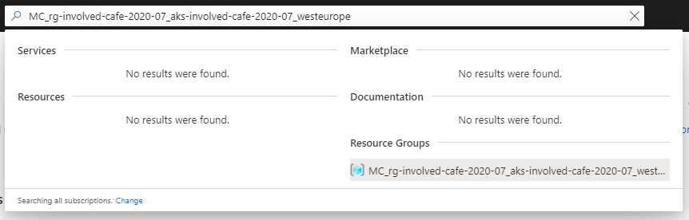

# BuildingCloudNativeApplicationsUsingOrleans-DevSum-2023

[Previous step](../step-10/README.md) - [Next step](../step-12/README.md)

## Step 11 - Finding the recource group that bundles all Kubernetes network resources

The web application is exposed inside the Kubernetes cluster, but not accessible from the outside world. For this to work, we will need to add some things to Kubernetes and Azure.

Azure has created a seperate resource group for all Kubernetes networking components. Use the following command to learn the name of this resource group:

```
az aks show --resource-group <your resource group> --name <your aks cluster> --query nodeResourceGroup -o tsv
```

```
az aks show --resource-group rg-dotnetdeveloperdays-2022 --name aks-dotnetdeveloperdays-2022 --query nodeResourceGroup -o tsv
```

For my case, it outputs the following resource group:

```
MC_rg-dotnetdeveloperdays-2022_aks-dotnetdeveloperdays-2022_westeurope
```

You can find the resource group and its resources inside the Azure Portal using the search feature:



[Previous step](../step-10/README.md) - [Next step](../step-12/README.md)